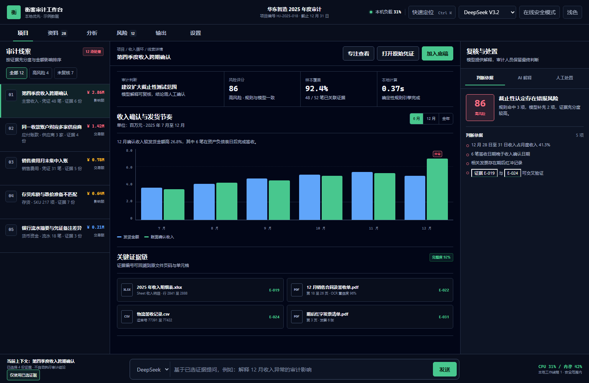

# AI 财务审计分析平台

面向财务、审计和内控人员的本地优先 AI 工作台。仓库包含产品资料、V3.2 视觉基准，以及正在开发的 React + FastAPI 生产工程。

> 当前仓库用于产品设计和 MVP 开发准备。页面中的企业名称、金额、风险事项和文件均为示例数据。

## 产品原则

- 本地优先：账表解析、金额计算和规则判断优先在本机完成
- API 增强：支持 DeepSeek、GLM、Kimi、通义千问及 OpenAI 兼容接口
- 证据优先：模型结论必须关联原始文件、页码、单元格或交易记录
- 人工决策：大模型负责解释和归纳，不替代审计人员最终判断
- 轻薄本可用：本地任务并发数为 1，整机负载超过阈值自动暂停
- 严格离线：离线模式下禁止调用大模型和 OCR 外部接口

## 文档

- [详细 PRD](docs/AI财务审计分析平台_MVP_详细PRD.md)
- [MVP 产品需求说明书](docs/01_AI财务审计分析平台_MVP产品需求说明书.docx)
- [MVP 技术架构设计说明书](docs/02_AI财务审计分析平台_MVP技术架构设计说明书.docx)
- [开源项目选型与许可证评估](docs/03_AI财务审计分析平台_开源项目选型与许可证评估.docx)
- [MVP 开发计划与验收标准](docs/04_AI财务审计分析平台_MVP开发计划与验收标准.docx)

## 前端原型

| 版本 | 说明 | 入口 |
|---|---|---|
| V1 | 基础功能和页面结构验证 | [打开文件](prototypes/v1/index.html) |
| V2 | 工作台信息架构与 AI 协作布局 | [打开文件](prototypes/v2/index.html) |
| V3 | 线索队列、证据画布、风险处置三栏工作台 | [打开文件](prototypes/v3/index.html) |
| V3.2 | 降低视觉噪声，增加专注模式、复核标签和移动端工作区 | [打开文件](prototypes/v3.2/index.html) |

V3.2 默认不依赖 npm、CDN 或后端服务，可以下载仓库后直接双击 `prototypes/v3.2/index.html` 使用。



## 目录结构

```text
docs/                 正式产品和技术文档
prototypes/v1/        第一版前端原型
prototypes/v2/        第二版前端原型
prototypes/v3/        第三版前端原型及设计系统
prototypes/v3.2/      当前推荐版本及设计审计
scripts/              文档生成脚本
```

## 安全说明

- 不要把真实 API Key、客户账套、银行流水或审计底稿提交到仓库
- 正式产品应使用操作系统凭据库保存模型和 OCR 密钥
- 真实项目数据应使用独立目录，并默认加入 `.gitignore`
- 对外部 API 的每次调用都应保留提供商、模型、时间和输入摘要

## 当前状态

第一版实现了迭代零和迭代一的可运行纵向切片：

- 创建、保存和重新打开隔离项目。
- 批量导入 PDF，由持久化单工作器计算 SHA-256、识别重复文件、隔离损坏件并提取页级原文。
- 通过 PDF.js 本地查看文档、跳转页码、缩放和搜索已提取原文。
- 显示真实任务状态、错误码、暂停、继续、取消与重试动作。
- 本地服务只监听 `127.0.0.1`，通过随机 HttpOnly Cookie 建立本机会话。
- 默认启用严格离线和 synthetic 演示项目，不调用任何外部模型、OCR、Embedding 或遥测服务。
- 提供迭代二模型网关安全骨架：服务商与模型能力档案、Windows DPAPI 密钥轮换、全局与项目双重外发控制、Fake Provider 路由、OpenAI-compatible 适配器及调用审计。
- 模型网关支持对超时、限流和服务不可用进行可审计的备用模型切换；本地响应缓存可启停、统计和二次确认清空。
- 服务商与模型档案支持二次确认删除；有关联模型的服务商会拒绝删除，历史调用审计始终保留。
- 支持从本地 PDF 搜索命中选择支持证据或反证；服务端重新校验并固化页码、文本块、原文片段和解析版本。
- PDF 导入会识别无足够原生文本的扫描页；合成项目逐页本地渲染并用 Fake Vision 生成明确标注的固定 JSON，真实项目保持“等待视觉策略”且不会上传页面。
- 提供人工风险草稿、PRD 约束的状态流转、复核备注和不可覆盖版本历史；证据可回跳到 PDF 原文。
- 风险解释当前只使用 Fake Provider，风险等级固定为“待评估”；所有金额与规则结果由本地代码计算，模型不参与复算或最终判断。
- CSV 科目余额表已作为正式结构化输入进入迭代四：导入前执行严格预览校验，确认后由本地单工作器写入不可变数据集，并使用 DuckDB 与 Decimal 复算借贷平衡、余额公式和跨期衔接。
- 规则失败只生成“待评估”风险草稿；风险可回溯至原文件 SHA-256、数据集版本和 CSV 行级明细，同一文件及同一规则版本不会重复计算。

真实外部模型连接、真实扫描件视觉服务、统计异常分析、自动风险分级和报告导出仍未启用，不代表功能已实现。

迭代一的自动化验收、资源基线和已知边界记录在
[验收记录](docs/acceptance/iteration-1-2026-09-22.md)；仓库同时提供 Windows GitHub Actions 质量门禁。
模型网关安全骨架的范围和验证结果记录在
[迭代二阶段验收](docs/acceptance/iteration-2-foundation-2026-09-22.md)，备用路由、缓存和安全删除的增量验收记录在
[迭代二网关闭环验收](docs/acceptance/iteration-2-routing-cache-2026-09-22.md)。证据选择、人工风险卡和版本历史记录在
[迭代三证据与风险版本基础验收](docs/acceptance/iteration-3-evidence-risk-foundation-2026-09-22.md)。
扫描页检测、本地逐页渲染和 Fake Vision 页级审计记录在
[迭代三扫描页视觉基础增量验收](docs/acceptance/iteration-3-scanned-page-foundation-2026-09-22.md)。
科目余额表数据契约、首批规则和风险边界记录在
[ADR-0004](docs/adr/0004-trial-balance-csv-deterministic-rules.md)，实现范围和验证结果记录在
[迭代四财务数据与确定性规则验收](docs/acceptance/iteration-4-financial-data-2026-09-22.md)。

## 生产工程结构

```text
frontend/       React + TypeScript + Vite + PDF.js
backend/        FastAPI、SQLite 项目仓和本地单工作器
tests/          前端端到端场景（位于 frontend/tests）
data/           运行时本地数据（被 Git 忽略）
scripts/        启动和验收入口
design-system/  生产界面设计令牌与约束
```

## 安装与启动

环境要求：Windows 10/11、Node.js 24、Python 3.12、npm 和 uv。

```powershell
uv sync
npm.cmd --prefix frontend ci
powershell -NoProfile -ExecutionPolicy Bypass -File scripts/dev.ps1
```

启动脚本会打开 `http://127.0.0.1:5173`。按 `Ctrl+C` 同时停止前端和后端。使用 `-NoOpen` 可以不自动打开浏览器。

## 检查与测试

运行完整的静态检查、单元测试和生产构建：

```powershell
powershell -NoProfile -ExecutionPolicy Bypass -File scripts/check.ps1
```

运行浏览器端到端测试前需要安装 Playwright Chromium（首次一次）：

```powershell
npm.cmd --prefix frontend exec playwright install chromium
npm.cmd --prefix frontend run e2e
```

E2E 使用独立的 `127.0.0.1:5174` 前端、`127.0.0.1:8100` 后端和
`.runtime/e2e-data` 合成数据目录，不复用日常开发项目。

测量空闲前后端进程的 CPU 与内存基线：

```powershell
uv run python scripts/measure_baseline.py --duration 10
```

锁文件 `uv.lock` 和 `frontend/package-lock.json` 是依赖版本的唯一可信来源。
